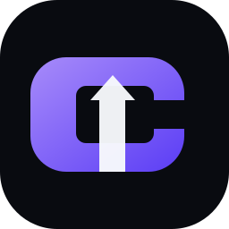

<div align="center">



# C1 Proxy

### A maintainable, self-hosted edge proxy control plane for Cloudflare Workers

**VLESS · WebSocket · Multi-user · D1 · Clean IP · Clash · sing-box · Base64**

[](https://deploy.workers.cloudflare.com/?url=https://github.com/ehsanef/C1-proxy)

[](LICENSE)
[](version.json)
[](https://workers.cloudflare.com/)

**[راهنمای فارسی](README.fa.md)**

</div>

---

## What C1 is

C1 Proxy is an independent, modular proxy panel designed for people who want to run their own private edge endpoint on Cloudflare Workers. The source stays readable and organized; Wrangler bundles it into a compact Worker at deploy time.

The public beta focuses on a small set of features that can be implemented and audited well instead of hiding a huge monolithic artifact behind a panel.

### Included in 0.1.0

- One-click **Deploy to Cloudflare**.
- Automatic provisioning of **D1** and **KV** by Cloudflare.
- Secure first-install admin setup.
- Multi-user management with quota, daily quota, expiry and enable/disable.
- Per-user private subscription token and UUID.
- **VLESS over WebSocket + TLS** profiles.
- Base64/raw, Clash/Mihomo and sing-box subscriptions.
- Per-user or global clean-IP targets.
- Traffic accounting written at connection close, not on every data chunk.
- JSON backup export.
- Minimal health endpoint and unbranded decoy root page.
- PBKDF2 password hashing, signed sessions, CSRF checks and login throttling.

## One-click install

Click the button:

[](https://deploy.workers.cloudflare.com/?url=https://github.com/ehsanef/C1-proxy)

Cloudflare will clone the public repository into the installer's GitHub account, create the Worker, provision the D1 database and KV namespace, configure Workers Builds, and deploy it.

After deployment, open:

```text
https://YOUR-WORKER.YOUR-SUBDOMAIN.workers.dev/admin
```

If the panel is new, C1 redirects you to `/install`.

For the safest install, set a random `C1_CLAIM_TOKEN` during the Cloudflare deployment flow and enter the same token during first setup.

## Manual install

```bash
git clone https://github.com/ehsanef/C1-proxy.git
cd C1-proxy
npm install
npx wrangler login
npm run deploy
```

Wrangler 4.x can automatically provision the D1 and KV bindings declared in `wrangler.jsonc`.

## How users connect

Create a user from the admin panel. C1 gives the user a subscription URL:

```text
https://YOUR-HOST/s/USER_TOKEN
```

The same link auto-detects many clients. Explicit formats are also available:

```text
/s/USER_TOKEN?format=base64
/s/USER_TOKEN?format=clash
/s/USER_TOKEN?format=singbox
```

The WebSocket path generated for that user is private and uses both a subscription token in the path and the user's VLESS UUID during the protocol handshake.

## Architecture

```text
src/
├── index.ts              request router
├── app/                  HTML/UI and HTTP helpers
├── auth/                 password/session/CSRF logic
├── database/             D1 schema and repositories
├── proxy/                VLESS parser + WebSocket relay
├── subscriptions/        Base64/Clash/sing-box generators
└── utils/                encoding/network helpers
```

The proxy hot path avoids database work per packet. Traffic counters are accumulated in memory for the connection and persisted on close.

## Security notes

C1 is a network relay. Treat every user subscription URL and UUID as a credential.

- Keep the admin password private.
- Use a random install claim token.
- Use a custom domain when appropriate.
- Delete users you no longer trust; disabling a user stops new connections.
- C1 blocks loopback, link-local, common RFC1918 private IPv4 targets and a small set of risky service ports from the relay.
- The root route does not advertise C1 or its version.

See [SECURITY.md](SECURITY.md).

## Public beta scope

C1 0.1.0 is deployable and usable, but it is **not yet full Nova feature parity**. The roadmap includes Trojan, Shadowsocks AEAD, WARP/AmneziaWG profile support, Telegram control, GitHub subscription mirror, C1 Radar, richer routing policies, restore/import, and additional transports.

Those features are intentionally not represented as finished until they have code and tests.

## License and upstream history

C1-authored code is MIT licensed. C1 is independent from Nova Proxy and does not include Nova's later PolyForm-protected release code or branding. See [THIRD_PARTY_NOTICES.md](THIRD_PARTY_NOTICES.md).
